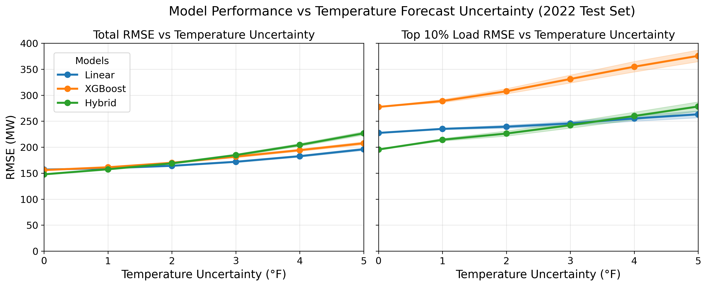

# Day-Ahead Load Forecasting Under Weather Forecast Uncertainty

This project explores day-ahead electricity load forecasting under realistic operational constraints, with a focus on model robustness when temperature forecasts are imperfect. Rather than evaluating models under observed temperatures, this analysis stress-tests three model classes under simulated temperature forecast uncertainty to identify which models remain reliable when inputs are noisy and how performance shifts during peak load periods.

## Project Report

A full write-up of the methodology, results, and discussion is available in [`report.pdf`](report.pdf).

## Motivation

In operational practice, day-ahead load forecasts rely on weather forecasts rather than realized temperatures. Models evaluated under observed temperatures may overstate real-world performance. This project addresses that gap by:

- Imposing realistic operational feature constraints: no short-horizon load lags, forecasted temperature only
- Applying Monte Carlo temperature perturbations to simulate day-ahead forecast uncertainty
- Evaluating model robustness not just on overall RMSE but specifically on peak-hour performance

## Dataset

Data was obtained from the **PG&E 2025 Energy Analytics Challenge** and consists of hourly electricity load and weather observations for the San Diego, California region spanning 2020–2022. The dataset is publicly available and included in this repository under `/data`.

Features used:
- Cyclical hour encodings, weekend and notable-day indicators
- Averaged temperature across five neighboring sites, 6-hour rolling temperature average, cooling and heating degree terms
- 24-hour and 48-hour lagged load features
- Short-horizon lags (e.g., t-1) were excluded to reflect day-ahead operational constraints

## Models

Three model classes were evaluated, each trained as 24 separate hourly models to capture intraday load dynamics:

- **Linear Regression**: baseline, ordinary least squares per hour
- **XGBoost**: gradient boosted trees with hour-specific hyperparameter tuning
- **Hybrid Linear + XGBoost**: linear model captures primary structure; XGBoost trained on out-of-sample residuals to learn nonlinear corrections

## Methodology

- **Train/test split**: trained on 2020–2021, evaluated on held-out 2022 test set
- **Cross-validation**: 5-split expanding-window time-series cross-validation within training period
- **Temperature uncertainty simulation**: Monte Carlo perturbations applied to temperature inputs at sigma = 1–5°F, with 100 simulations per uncertainty level; features recalculated for each simulation
- **Evaluation**: overall RMSE, top 10% highest load hours, seasonal partitions, hourly heatmaps

## Key Findings

- Under perfect temperature inputs, the hybrid model achieved the lowest RMSE (147.8 MW), outperforming standalone XGBoost (155.9 MW) and Linear Regression (156.9 MW)
- With increasing temperature forecast uncertainty, the hybrid model lost its advantage; at sigma >= 3°F, Linear Regression became the most robust model
- Focusing on the top 10% of highest load hours revealed dramatic shifts: XGBoost's RMSE increased roughly 78%, from 155.9 MW to 277.4 MW, while Linear Regression remained comparatively stable
- These results highlight a trade-off between baseline accuracy and robustness: more flexible models achieve lower error under perfect inputs but are more sensitive to temperature forecast noise



## Repository Structure

The project separates exploratory analysis and prototyping (notebooks) from reproducible execution (src scripts). The notebooks document the thinking and iteration behind each stage. The src scripts are the cleaned, runnable versions that reproduce all results from the terminal.

```
load_repo/
├── data/
│   ├── raw/                         # Raw load and weather data (Train.xlsx, Test.xlsx)
│   ├── processed/                   # Feature-engineered datasets for each model stage
│   ├── results/                     # Monte Carlo simulation outputs and error CSVs
│   └── splits/                      # Train/validation/test split indices
│
├── notebooks/
│   ├── eda.ipynb                    # Exploratory analysis: load profiles, temperature relationships, autocorrelation
│   ├── feature_design.ipynb         # Feature engineering and nowcast baseline for feature selection
│   ├── day_ahead_modelling.ipynb    # Hyperparameter tuning for XGBoost and hybrid models
│   ├── day_ahead_model_analysis.ipynb  # Model evaluation, Monte Carlo prototyping, plot development
│   └── model_analysis.ipynb         # Nowcast model evaluation and highest load day analysis
│
├── src/
│   ├── split_construction.py        # Constructs train/validation/test split indices
│   ├── features/                    # Feature engineering scripts for each model stage
│   ├── models/                      # Model training scripts and saved hyperparameter configs
│   └── results/                     # Monte Carlo simulations, conditional evaluation, plot generation
│
├── trained_models/                  # Serialized trained model objects (.pkl)
├── plots/                           # All output figures
├── report.pdf                       # Full project report
├── requirements.txt                 # Python dependencies
└── README.md
```

## Reproducing Results

All results can be reproduced by running the src scripts in order from the terminal:

```bash
# 1. Construct train/validation/test splits
python src/split_construction.py

# 2. Build features
python src/features/build_day_ahead_features.py

# 3. Train models (example)
python src/models/day_ahead_lin_xgb.py

# 4. Run Monte Carlo uncertainty analysis and generate plots
python src/results/day_ahead_temp_uncertainty_filter_none.py
python src/results/create_plots.py
```

## Requirements

```bash
python -m venv env
source env/bin/activate        # Mac/Linux
env\Scripts\activate           # Windows
pip install -r requirements.txt
```

## Limitations

- Temperature forecast errors are simulated synthetically and not calibrated to real NWP forecast error distributions
- Only temperature uncertainty is modeled; solar irradiance and other exogenous uncertainties are excluded
- The historical load-temperature relationship is assumed stable across the evaluation period
